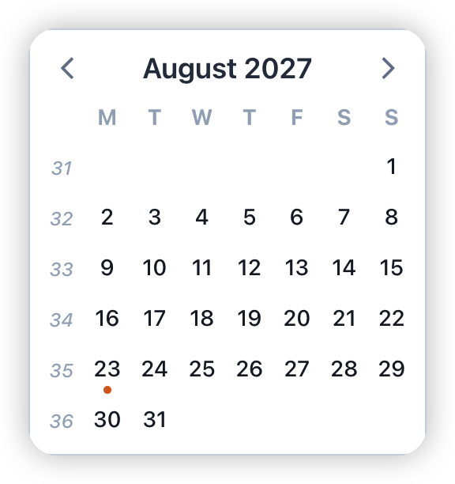
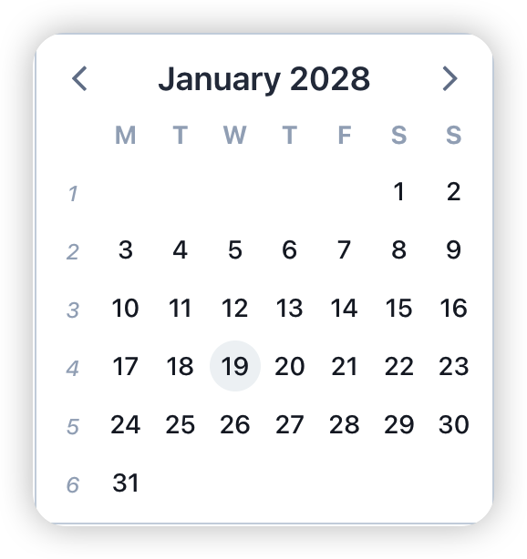
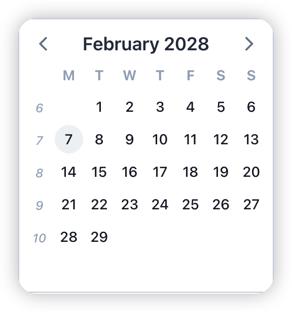
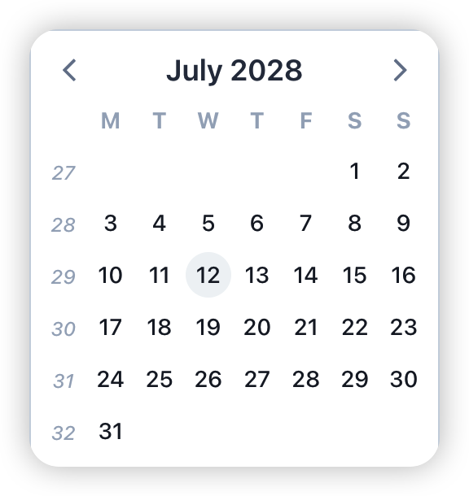

## 🏠 Personal & Growth
- 7 月十几号休假到 8 月 25 左右
- 2027 年下半年教学周
	- | 开始周 | 结束周 |
	  |  |  |
	- 2027.08.23 - 2028.01.19 (腊月二十三)
		- 2027 年：35 周到 52 周共 **18** 周
		- 2028 年：4 周
		- 共约 22 周
- 2028 年上半年教学周
	- | 开始周 | 结束周 |
	  |  |  |
	- 2028.02.07 (正月十三) - 2028.07.12
		- 7 周到 28 周共约 22 周
- ```calc
  28 - 7
  ```